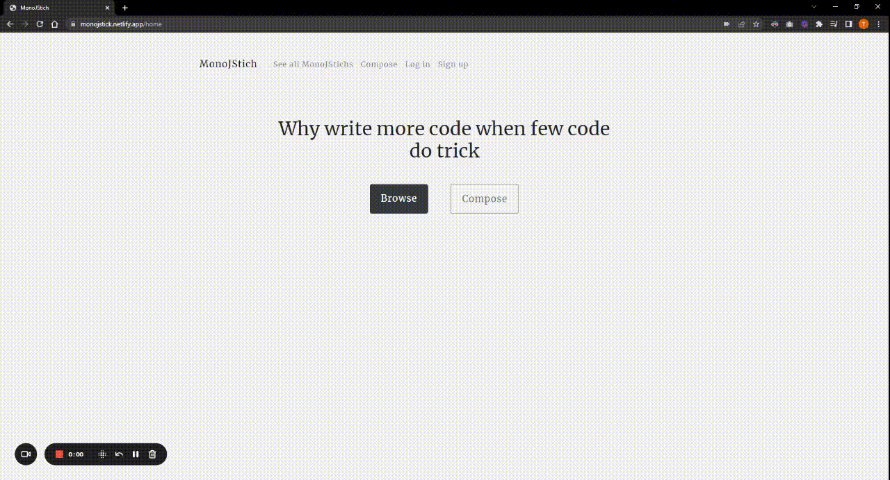

# MonoJstich
A place for people to share their favorite Javascript oneliners.

**Link to project:** https://monojstick.netlify.app

# How It Works:

1. Click on "Browse" on home page or "See all MonoJStichs" on top to see and copy all JavaScript one-liners shared by other people
2. Submit your own one-liner by clicking "Compose" on home page or on top (make sure it's valid JavaScript code)
3. Click "Submit" and click "See all MonoJStichs" to see your recently submitted code
4. (optional) Register an account by cliking "Sign Up" on top to get the ability to edit or delete the code you submitted

# How It's Made:

This app is built with React, Bootstrap, Webpack, Google Firebase Authentication SDK, and Firestore real time database

After introducing code golf (solve coding problem with the least amount of code) on Clash of Code to my friend Jasper, he gave me the idea to build this application to allow people to share their favorite one-liner JavaScript codes (possibly Python too).

I decided to design a clean and responsive UI to allow for easy navigation with a minimalist styling.

I also realized that no everyone want to make an account to submit their code, so I made it so that anyone can submit their code as long it's validated to make sure it's error-free JavaScripts. But I also added a login function to allow people who submitted their code to be able to edit or delete their snippets if they want.

I hope you enjoy this app!

# Chellenges:

While this is a small project, I wanted to make sure users have good experience while using the app. So most of the challenge actually came from front end, which I previously has not given too much thought about.

To make sure the UI is clean, intuitive and responsive, I went through several iterations of design using Excalidraw and Adobe Colors. At the end, I opted to Bootstrap instead of regular CSS to make stlying less painful.

Another challenge I met was connecting the frontend to Firebase v9. Because the new version of Firebase just came out, it did not have many online resources, so I read through its official docs to learn how to implement it to this application to perform basic CRUD and authentications. Overall, it was an interesting learning experience as Google writes decent documentations with easy-to-understand examples.
